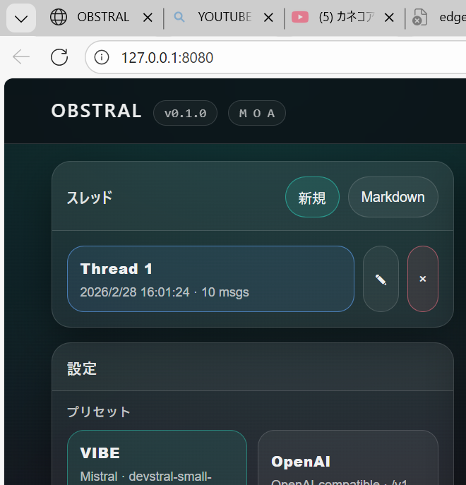

# OBSTRAL

「デュアルブレイン」型のコーディング・コックピット:

- **Coder**: ファイル作成/編集、コマンド実行まで行う（承認ゲートあり）
- **Observer**: 実況しながら批評し、次の一手を提案する（スコア付き）
- **Chat**: 壁打ち/雑談/アイデア出し（実装ループを壊さない）

Languages: [English](README.md) | [Japanese](README.ja.md) | [French](README.fr.md)



## 見どころ（ユニークポイント）

OBSTRALは「チャットUI」ではなく、**LLMの実行ループを制御するランタイム**です。

- **実行ファースト**: `write_file` / `exec` を承認ゲート付きで運用（human-in-the-loop）
- **デュアルエージェント**: Coderが実行、Observerが監査（提案をスコアリング）
- **ループ検出**: 同じ批評を繰り返すとUIが色相シフトして警告、同じ失敗コマンドの反復も抑止
- **サンドボックス**: `.tmp/<thread-id>` に隔離して「ネストgit地獄」を避ける
- **Windows実戦耐性**: PowerShellネイティブ、WDACでEXEが動かない環境向けPython Liteあり

## これは何？

多くのLLMツールは「会話」を最適化します。

OBSTRALは「**制御された実行ループ**」を最適化します。

- Coder vs Observer の緊張関係
- proposals のスコアリング + フェーズ制御（core/feature/polish）
- ループ検出（同じ批評、同じ失敗コマンドの反復）
- 安全装置（Edit/Command approval、tool_rootでの隔離）

## 起動（Rustサーバ）

### Web UI

```powershell
.\scripts\run-ui.ps1
```

ブラウザで開く:

- `http://127.0.0.1:18080/`

### TUI

```powershell
.\scripts\run-tui.ps1
```

補足: UI/TUIが共存しやすいよう、スクリプト側で `CARGO_TARGET_DIR` を分離しています。

## Liteサーバ（Python）

RustのEXEが実行できない環境（例: WDACで新規バイナリがブロックされる）向けに、Pythonフォールバックがあります:

```powershell
python .\scripts\serve_lite.py
```

これは互換・救済モードであり、全機能の代替ではありません。

## 主な機能

### Chat タブ — ペルソナチップバー

Chat コンポーザーの上に5つのチップが並びます。セッション中いつでも切り替え可能で、Coder / Observer のペルソナとは完全独立です（デフォルト: 😊 陽気）:

| チップ | スタイル |
|---|---|
| 😊 陽気 (cheerful) | 明るく前向きに応答 |
| 🤔 思慮深い (thoughtful) | 前提を確認しながら丁寧に |
| 🧙 師匠 (sensei) | 問いかけで気づかせるスタイル |
| 😏 皮肉屋 (cynical) | 核心を鋭く指摘 |
| 🦆 ゴム鴨 (duck) | 答えを出さず「なぜ？」で思考整理 |

### Observer — ヘルスバッジ `❤ N`

Observer が `--- health ---` ブロックを出力すると、ステータスバーにスコアが表示されます:

| スコア | 色 | 意味 |
|---|---|---|
| ≥ 70 | 緑 | 本番相当 |
| 40–69 | 橙 | 開発・デモ可 |
| < 40 | 赤 | 即対応が必要 |

### Observer — 提案ステータスのライフサイクル

Observer が同じ提案を繰り返し出した場合、スルーした回数に応じてステータスが昇格します:

| status | 意味 | スコア補正 |
|---|---|---|
| `new` | 初回出現 | ±0 |
| `[UNRESOLVED]` | 1回スルー | +10 |
| `[ESCALATED]` | 2回以上スルー・先頭強制表示 | +20 合計 |
| `addressed` | 対応済み（シアン表示） | — |

### `quote` フィールド

`warn` / `critical` 提案には `quote` フィールドが必須です。該当コードをカード上にシアンのモノスペースで表示します:

```
❝ user_input = input()
```

---

## 重要な概念

### tool_root

エージェントの実行（ファイル/コマンド）は `tool_root` 配下に閉じ込めます。

デフォルトは `.tmp/<thread-id>` で、スレッドごとに隔離して「ネストしたgitリポジトリ事故」を避けます。

### 承認（Approvals）

- **Edit approval**: `write_file` は保留（pending edits）に積まれ、承認後に反映されます
- **Command approval**: `exec` は保留（pending commands）に積まれ、承認/却下できます（承認後にCoderを再開）

## Providerと実戦エラー

OBSTRALは OpenAI互換APIを中心に、`ChatProvider` traitで複数プロバイダを差し替えられる設計です。

よくある実戦エラー:

- `401 Unauthorized`: APIキー不正/未設定
- `429 Too Many Requests`: レート制限（バックオフが必要）
- `max_tokens` / `max_completion_tokens`: モデルごとのパラメータ差

## セキュリティ

前提はローカル（`127.0.0.1`）運用です。

ネットワークに公開するなら、認証とツール実行の更なるハードニングが必須です。

## トラブルシュート

### GitHubへのpushが `127.0.0.1` 経由で失敗する

環境変数で死んだプロキシが強制されている可能性があります。

PowerShellセッション内で解除:

```powershell
Remove-Item Env:HTTP_PROXY,Env:HTTPS_PROXY,Env:ALL_PROXY,Env:GIT_HTTP_PROXY,Env:GIT_HTTPS_PROXY -ErrorAction SilentlyContinue
```

### 対話プロンプト無しでpushする（WDAC回避）

環境によっては、gitの対話プロンプトが壊れます（例: `sh.exe` が Win32 error 5 で落ちる）。

GitHubトークンが使えるなら、1回だけ非対話でpushできます:

```powershell
$env:GITHUB_TOKEN = "ghp_..."
.\scripts\push.ps1
```

### SSH(443)でpushする（企業ネットワーク向け）

ネットワークやプロキシ制限がある環境では、SSH over 443 を使うのが安定です:

```powershell
.\scripts\push_ssh.ps1
```

### `cargo run` が `obstral.exe` を消せず失敗する（アクセス拒否）

同じターゲットのEXEが実行中です。

- `.\scripts\kill-obstral.ps1`
- もしくは `.\scripts\run-ui.ps1` / `.\scripts\run-tui.ps1` を使ってください

## License

MIT
